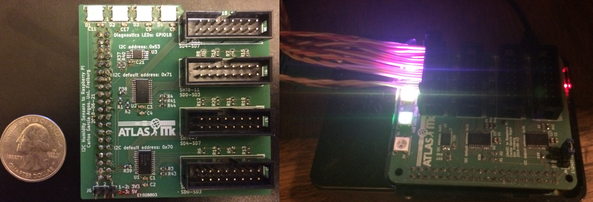

# Repository for storage temperature humidity monitor
 
 
 This python module is meant to enable a raspberry pi to acquire data from up to 16 SHT21 sensors connected over i2c. 
 It comes with a sytemd timer that runs every 10 seconds once started and the data can either be stored on disk or sent to an influxdb. 

## Dependencies:

nclib (pip install nclib)
i2c-tools (sudo apt-get install i2c-tools)

## Installation:
```
git clone https://github.com/kuchosauronad0/sht21pi.git
cd sht21pi
sudo python setup.py install

sudo make install # this creates directories and copies the systemd unit + timer
```


### Usage:
You can run the module with
`python -m sht21pi.core -c /etc/sht21pi/sht21pi.conf`
OR
activate and enable the systemd unit so that it is started after reboot with
`sudo systemctl start sht21pi; sudo systemctl enable sht21pi`

### Troubleshooting:
```
# detect devices:
sudo i2cdetect -y 0
sudo i2cdetect -y 1
# run the unittest:
python -m unittest sht21pi.core

less /var/log/sht21pi/sht21-application.log
```


#### AttributeError: StorageHumidityMonitor instance has no attribute 'bus'

Fix: `raspi-config` point 5 "Interfacing options" enable SPI (for the leds) and I2C (for the sensors)

#### NameError: global name 'bus' is not defined

`apt-get install python-smbus`

#### /dev/i2c-0  /dev/i2c-1 are not visible

/boot/config.txt is missing 'dtparam=i2c_vc=on'

### Dependencies

nclib for communicating with the database (`pip install nclib`)
